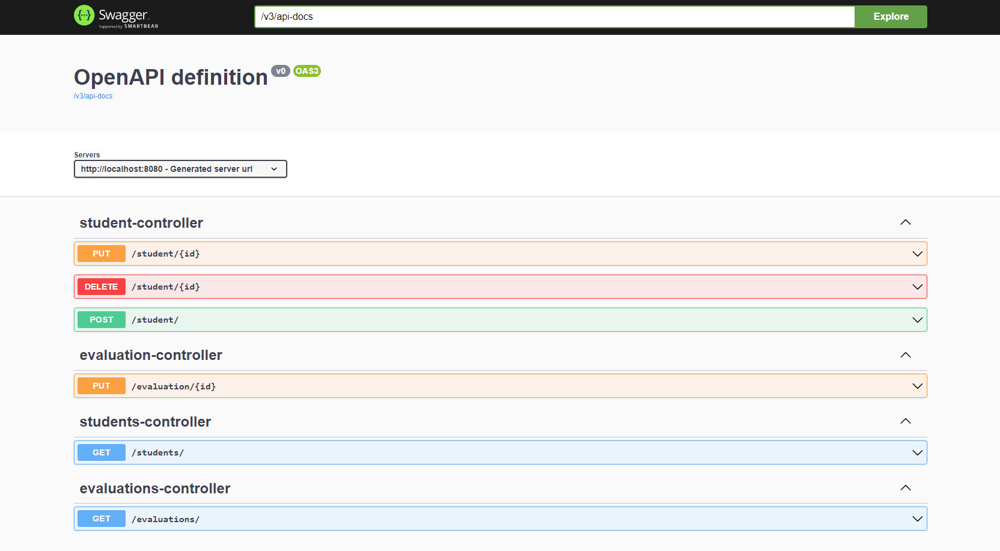

# Тестовое задание для SML

### Тестовое задание (оригинальное описание)

Реализовать **REST АПИ** для клиентского приложения, которое должно отображать страницу со списком студентов с возможностями:
1. добавить нового студента в список;
2. удалить существующего студента;
3. отредактировать существующего студента;
4. внести изменения названий (поле **text**) в справочнике успеваемости. Исходные значения:
   **[{id 2, text "неуд"}, {id 3, text "уд"}, {id 4, text "хор"}, {id 5, text "отл"}]**

У студента есть поля:
- ФИО
- дата рождения
- успеваемость (опционально, значение из справочника)

Предлагаемый стек:
**Java, Spring Framework, PostgreSQL, Spring-data, Liquibase/Flyway, Swagger, Docker**

Сопутствующие требования:
1. **инструкция по разворачиванию** исходной версии СУБД;
2. автогенерация **swagger-документации** на основании исходного кода;
3. **валидация**

---

### Используемый мною стек:
* Java 17
* Maven
* Spring Boot, Data, Test, Validation
* PostgreSQL
* Liquibase
* JUnit 5
* JoCoCo
* Swagger
* Docker

---

### Инструкция по развертыванию

#### Локально для разработки

1. Создать базу данных **test_app** в **PostgreSQL 12+**.
   Проверить "src/main/resources/application-local.properties".
2. Установить/проверить **JDK 17**
3. В IDEA запустить **Main.class** -> **"Configuration"** -> **"Edit..."** -> В **"Active profiles"** установить **"local"**.

#### Docker

Приложение после запуска доступно по http://localhost:8080/, можно изменить порт в **docker-compose.yml**.

~~~
$ docker-compose build
$ docker-compose up
~~~

**Sql скрипты** из папки **db/scripts** сами запустятся в контейнере, если база данных ранее не была проинициализирована.
Файлы бд будут смонтированы в **/target**, можно просто сделать **mvn clean**.

---

### Swagger

При запущенном приложение Swagger доступен по следующей ссылке:
http://localhost:8080/swagger-ui/index.html

